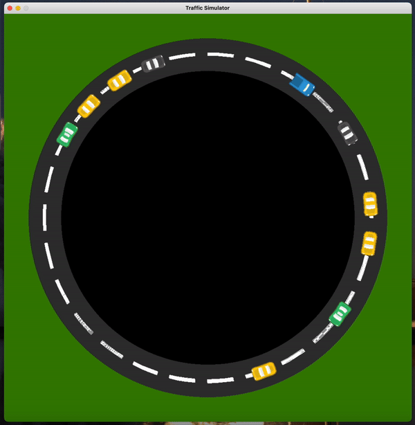

# Phantom Traffic Jam Simulator

<p align="center">
  
</p>

Small python project to simulation phantom traffic.

Uses [pygame](https://www.pygame.org/news) to simulate how traffic can be created when a car slows down suddenly and other cars must respond accordingly.
The cars go around a roundabout (or circle) forming clusters of traffic (or slow zones) over time.

The main entry point into the program is [traffic_sim.py](./traffic_sim.py). You can run it:

```bash
python3 traffic_sim.py
```
